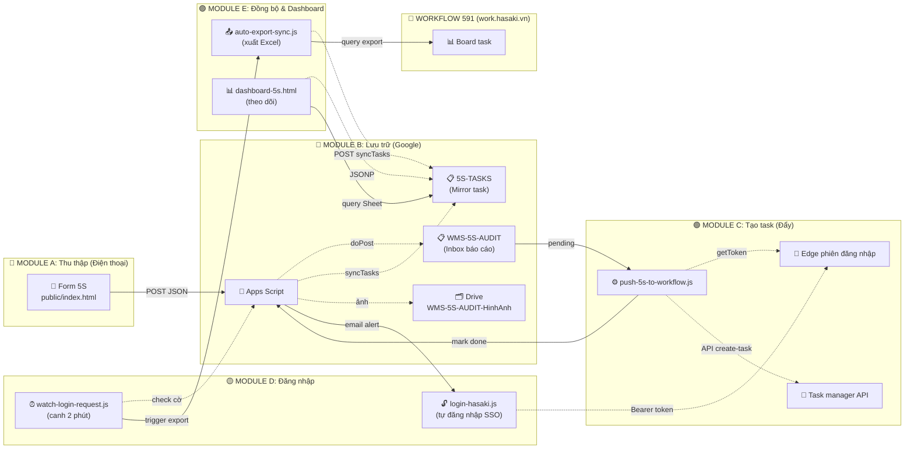

# 🔄 LUỒNG DỮ LIỆU CHI TIẾT — Diagram & Timeline

---

## 📊 Diagram Kiến Trúc Toàn Hệ Thống



---

## ⏱️ Timeline: Từ Form → Task → Dashboard

### **Thời gian thực tế (2026-07-05)**

```
14:30:00 ┌─────────────────────────────────────────────────────────┐
         │ 👨 Nhân viên ghi form 5S trên điện thoại              │
         │   ├─ Quét vị trí: F0-A1-S2                             │
         │   ├─ Chọn hạng mục vi phạm: [Sắp xếp, Vệ sinh]        │
         │   ├─ Chụp 2 ảnh                                        │
         │   └─ Gửi → POST JSON                                  │
         └─────────────────────────────────────────────────────────┘
                          │
14:30:05                  ▼ (Apps Script nhận)
         ┌─────────────────────────────────────────────────────────┐
         │ 🤖 Google Apps Script doPost                           │
         │   ├─ Lưu 1 hàng vào tab WMS-5S-AUDIT (hàng 1001)      │
         │   ├─ Ảnh: tải lên Drive → URLdrive.google.com/uc...  │
         │   └─ Cột 6 (Mã task) trống = chưa đẩy                │
         └─────────────────────────────────────────────────────────┘
                          │
                          ├─ A: 2026-07-05
                          ├─ B: "Kệ rơi không sắp xếp"
                          ├─ C: "F0-A1-S2"
                          ├─ D: "Sắp xếp, Vệ sinh"
                          ├─ E: "https://drive.google.com/..."
                          └─ F: (trống)

14:45:00 ┌─────────────────────────────────────────────────────────┐
         │ ⏰ Bộ đẩy chạy (DAY-BAO-CAO-5S.bat)                   │
         │   node push-5s-to-workflow.js                          │
         └─────────────────────────────────────────────────────────┘
                          │
14:45:05                  ▼
         ┌─────────────────────────────────────────────────────────┐
         │ 1️⃣ Lấy token từ phiên Edge                             │
         │    ├─ Launch Edge (headless)                           │
         │    ├─ Navigate tới work.hasaki.vn/tasks-workflow       │
         │    ├─ Canh header request → lấy Authorization         │
         │    └─ Token: "Bearer eyJhbGc..."                       │
         └─────────────────────────────────────────────────────────┘
                          │
14:45:20                  ▼
         ┌─────────────────────────────────────────────────────────┐
         │ 2️⃣ Lấy báo cáo chưa đẩy từ Apps Script                │
         │    ├─ GET ?action=pending&key=SECRET123               │
         │    └─ Response:                                        │
         │    {                                                   │
         │      "rows": [                                         │
         │        {                                               │
         │          "row": 1001,                                  │
         │          "ngay": "2026-07-05",                        │
         │          "viTri": "F0-A1-S2",                         │
         │          "hangMuc": ["Sắp xếp", "Vệ sinh"],          │
         │          "hienTrang": "Kệ rơi không sắp xếp",       │
         │          "images": [                                  │
         │            {"mime":"image/jpeg","base64":"...."}     │
         │          ]                                            │
         │        }                                              │
         │      ]                                                │
         │    }                                                  │
         └─────────────────────────────────────────────────────────┘
                          │
14:45:25                  ▼
         ┌─────────────────────────────────────────────────────────┐
         │ 3️⃣ Khớp hạng mục với TYPE00                            │
         │    ├─ "Sắp xếp" → TYPE00 = "Sắp xếp" (khớp tuyệt)  ✅ │
         │    ├─ "Vệ sinh" → TYPE00 = "Vệ sinh" (khớp tuyệt)   ✅ │
         │    └─ Tất cả khớp → tiếp tục                         │
         └─────────────────────────────────────────────────────────┘
                          │
14:45:30                  ▼
         ┌─────────────────────────────────────────────────────────┐
         │ 4️⃣ Tạo TASK #1 "Sắp xếp"                              │
         │    ├─ POST /api/hr/projects/create-task-workflow      │
         │    ├─ name: "[5S] F0-A1-S2 - Sắp xếp"                │
         │    ├─ date_start: 2026-07-05, date_end: 23:59:00     │
         │    ├─ staff_id: 17312 (Lê Chí Tâm)                   │
         │    ├─ TYPE00: "Sắp xếp"                              │
         │    ├─ BIN00: "F0-A1-S2"                              │
         │    ├─ note: "Kệ rơi không sắp xếp"                 │
         │    ├─ ảnh (2 file): base64 → Blob → FormData        │
         │    └─ Response: { "code": "HSK-00042", ... }         │
         └─────────────────────────────────────────────────────────┘
                          │
14:45:35                  ▼
         ┌─────────────────────────────────────────────────────────┐
         │ 5️⃣ Tạo TASK #2 "Vệ sinh"                              │
         │    (quá trình tương tự, nhưng TYPE00="Vệ sinh")       │
         │    └─ Response: { "code": "HSK-00043", ... }          │
         └─────────────────────────────────────────────────────────┘
                          │
14:45:40                  ▼
         ┌─────────────────────────────────────────────────────────┐
         │ 6️⃣ Ghi mã task ngược lại Sheet                         │
         │    ├─ GET ?action=mark&row=1001&code=HSK-00042     │
         │    ├─ GET ?action=mark&row=1001&code=HSK-00043     │
         │    └─ Hàng 1001 cột 6 (Mã task) = "HSK-00042, HSK-00043"
         └─────────────────────────────────────────────────────────┘
                          │
14:45:45                  ▼
         ┌─────────────────────────────────────────────────────────┐
         │ ✅ Log: "Hàng 1001: HSK-00042, HSK-00043             │
         │         (2 ảnh, TYPE00=[Sắp xếp,Vệ sinh])"           │
         └─────────────────────────────────────────────────────────┘


2026-07-06 07:00:00 ┌───────────────────────────────────────────────┐
                    │ ⏰ Auto-export chạy lịch (7h sáng)            │
                    │   node auto-export-sync.js                   │
                    └───────────────────────────────────────────────┘
                                   │
07:00:05                           ▼
                    ┌───────────────────────────────────────────────┐
                    │ 1️⃣ Lấy token từ Edge                         │
                    │    (tương tự bộ đẩy)                        │
                    └───────────────────────────────────────────────┘
                                   │
07:00:15                           ▼
                    ┌───────────────────────────────────────────────┐
                    │ 2️⃣ Queue export job                          │
                    │    ├─ Chia ngày: [2026-04-01..2026-05-30]   │
                    │    │             [2026-05-31..2026-07-07]   │
                    │    ├─ POST /api/hr/excel-io/export          │
                    │    │  param[from_date], param[to_date]      │
                    │    │  type=6 (board)                        │
                    │    └─ Queue 2 job                           │
                    └───────────────────────────────────────────────┘
                                   │
07:00:20                           ▼
                    ┌───────────────────────────────────────────────┐
                    │ 3️⃣ Poll status mỗi 3s                       │
                    │    GET /api/hr/excel-io                     │
                    │    ├─ Lần 1: status=0 (processing)         │
                    │    ├─ Lần 10: status=1, file_path="..." ✅ │
                    │    └─ Tải file từ wshr.hasaki.vn/...        │
                    └───────────────────────────────────────────────┘
                                   │
07:01:00                           ▼
                    ┌───────────────────────────────────────────────┐
                    │ 4️⃣ Tải file Excel (công khai)              │
                    │    ├─ GET https://wshr.hasaki.vn/...        │
                    │    ├─ Lưu .exports/board-2026-04-01.xlsx   │
                    │    └─ Parse XLSX                            │
                    └───────────────────────────────────────────────┘
                                   │
07:01:30                           ▼
                    ┌───────────────────────────────────────────────┐
                    │ 5️⃣ Gộp dữ liệu 2 window                      │
                    │    ├─ Window 1: 100 row                     │
                    │    ├─ Window 2: 42 row (có HSK-00042)       │
                    │    └─ Tổng: 142 row                        │
                    └───────────────────────────────────────────────┘
                                   │
07:01:45                           ▼
                    ┌───────────────────────────────────────────────┐
                    │ 6️⃣ Chuẩn hoá cột & media                     │
                    │    ├─ "task code" → "Mã công việc"          │
                    │    ├─ "task_wfconfig/..." → "hr-media...." │
                    │    └─ [Array chuẩn cho tab 5S-TASKS]        │
                    └───────────────────────────────────────────────┘
                                   │
07:02:00                           ▼
                    ┌───────────────────────────────────────────────┐
                    │ 7️⃣ Ghi tab 5S-TASKS trên Sheet               │
                    │    ├─ POST ?action=syncTasks                │
                    │    │  key=SECRET123                         │
                    │    │  body=JSON array 142 row               │
                    │    └─ Apps Script ghi đè hoàn toàn tab      │
                    └───────────────────────────────────────────────┘
                                   │
07:02:15                           ▼
                    ┌───────────────────────────────────────────────┐
                    │ ✅ Log: "Đã ghi 142 task vào tab 5S-TASKS   │
                    │         (2 window, ~60s tải + parse)"      │
                    └───────────────────────────────────────────────┘


07:02:30 ┌───────────────────────────────────────────────────────┐
         │ 📊 Dashboard cập nhật                                │
         │   ├─ JSONP query từ Sheet (Collaborative API)       │
         │   ├─ Lấy 142 row từ tab 5S-TASKS                   │
         │   ├─ Lọc: 42 vi phạm, 15 xác nhận, 8 hoàn thành   │
         │   └─ Render bảng + thống kê                         │
         └───────────────────────────────────────────────────────┘
                          │
                          ▼
         ┌───────────────────────────────────────────────────────┐
         │ 👨 Quản lý xem dashboard                             │
         │   ├─ Lọc ngày: 2026-07-05                           │
         │   ├─ Lọc lỗi: "Sắp xếp"                            │
         │   ├─ Thấy HSK-00042, HSK-00043                      │
         │   ├─ Bấm ảnh → Lightbox                             │
         │   ├─ Bấm mã → Modal chi tiết                        │
         │   └─ Xử lý vi phạm (cập nhật status trên workflow) │
         └───────────────────────────────────────────────────────┘
```

---

## 🔐 Timeline Đăng nhập (Khi phiên hết 48h)

```
T₀ + 48 giờ (phiên hết)
  ├─ Token Bearer không còn hiệu lực
  └─ getToken() → page.url() = /auth/login → lỗi

T₀ + 48h + 15 min
  ├─ Bộ đẩy chạy
  ├─ getToken() → lỗi "Phiên đã hết hạn"
  ├─ sendAlert() → Email: "⚠️ Phiên work.hasaki.vn đã hết"
  ├─ Email có nút ✅ (link /exec?action=requestLogin)
  └─ Apps Script cắt cờ requestLogin = true

T₀ + 48h + 20 min
  ├─ Quản lý bấm nút ✅ trong email (từ điện thoại)
  └─ Apps Script cắt cờ requestLogin = true (hoặc giữ nguyên)

T₀ + 48h + 22 min
  ├─ watch-login-request.js canh
  ├─ Hỏi ?action=loginStatus&key=SECRET → { "requested": true }
  ├─ Xoá cờ → ?action=clearLogin
  ├─ Chạy: node login-hasaki.js --auto (nền)
  │   ├─ Edge mở (headless, ngoài màn hình)
  │   ├─ Gõ email (real keyboard)
  │   ├─ Gõ password (real keyboard)
  │   ├─ TOTP sinh OTP (HASAKI_2FA_SECRET)
  │   ├─ Gõ OTP (6 số)
  │   └─ Mint token 48h mới ✅
  └─ Exit 0 (thành công)

T₀ + 48h + 45 min (lần tiếp theo bộ đẩy chạy)
  ├─ getToken() ✅ (token mới)
  ├─ Lấy báo cáo chưa đẩy
  ├─ Tạo task tiếp tục
  └─ Bình thường

⚠️ Nếu auto login fail:
  ├─ Exit code ≠ 0
  ├─ Không thao tác gì thêm
  ├─ watch-login-request.js sẽ thử lại mỗi 2 phút
  └─ Quản lý nhận email → bấm nút manual → thử lại
```

---

## 🔄 Timeline Cập nhật Dashboard (On-Demand)

```
14:30:00 ┌────────────────────────────────────┐
         │ 👨 Quản lý bấm nút                 │
         │ "⟳ Cập nhật ngay" trên dashboard  │
         └────────────────────────────────────┘
                          │
14:30:05                  ▼
         ┌────────────────────────────────────┐
         │ Dashboard hiển thị modal:          │
         │ [Nhập PIN: ___] [OK] [Hủy]        │
         └────────────────────────────────────┘
                          │
14:30:10                  ▼ (gõ "1234")
         ┌────────────────────────────────────┐
         │ Dashboard gọi:                     │
         │ POST ?action=requestSync           │
         │     &pin=1234                      │
         │     &callback=dashboardRefresh     │
         │ → Apps Script                      │
         └────────────────────────────────────┘
                          │
14:30:12                  ▼
         ┌────────────────────────────────────┐
         │ Apps Script:                       │
         │ ✅ PIN đúng (SYNC_PIN="1234")     │
         │ ✅ Cắt cờ SYNC_REQUESTED = true   │
         │ ✅ Response: {"success":true}      │
         └────────────────────────────────────┘
                          │
14:30:15 (Dashboard)      ▼
         ┌────────────────────────────────────┐
         │ ✅ Hiện toast: "Đã gửi yêu cầu   │
         │               cập nhật"           │
         └────────────────────────────────────┘

14:32:00 (watch-login-request.js canh)
         ┌────────────────────────────────────┐
         │ Canh mỗi 2 phút                    │
         ├─ Hỏi ?action=syncStatus           │
         ├─ Response: {"requested": true}    │
         ├─ Xoá cờ: ?action=clearSync       │
         ├─ Chạy: node auto-export-sync.js  │
         │        (chờ xong, ~60s)          │
         └────────────────────────────────────┘
                          │
14:32:05                  ▼
         ┌────────────────────────────────────┐
         │ auto-export-sync.js:               │
         │ ✅ Lấy token                       │
         │ ✅ Queue + poll export job         │
         │ ✅ Tải file Excel                 │
         │ ✅ Parse + gộp data                │
         │ ✅ POST syncTasks → Sheet         │
         └────────────────────────────────────┘
                          │
14:33:00                  ▼
         ┌────────────────────────────────────┐
         │ Sheet 5S-TASKS cập nhật            │
         │ (142 row mới)                      │
         └────────────────────────────────────┘
                          │
14:33:05 (Dashboard)      ▼
         ┌────────────────────────────────────┐
         │ Dashboard định kỳ refresh          │
         │ (JSONP query mỗi 10s)             │
         │ ✅ Lấy dữ liệu mới từ Sheet       │
         │ ✅ Render bảng + update card      │
         │ ✅ Người xem thấy tức thì         │
         └────────────────────────────────────┘
                          │
14:33:10                  ▼
         ┌────────────────────────────────────┐
         │ ✅ Dashboard đã cập nhật           │
         │    - 42 vi phạm (thay đổi)         │
         │    - 15 xác nhận (thay đổi)        │
         │    - 8 hoàn thành                  │
         └────────────────────────────────────┘
```

---

## 🛡️ Timeline Chống Chạy Chồng (Lock)

```
16:45:00 (Bộ đẩy tự chạy lịch)
  └─ DAY-BAO-CAO-5S.bat
                          │
16:45:10 ─────────────────▼
         ├─ getToken() ────→ Edge launch
         ├─ pending() ─────→ Apps Script
         ├─ create-task() ─→ Workflow API
         └─ mark() ───────→ Apps Script
                          │
         ⏱️ (Giả sử chạy 5 phút)
                          │
16:50:00 ─────────────────▼ XONG

16:50:30 (Người bấm "Cập nhật ngay")
         └─ watch-login-request.js nhìn thấy
            SYNC_REQUESTED = true
            ├─ Chạy auto-export-sync.js
            │  
            │  ├─ Tạo .export-running.lock
            │  │  (ghi timestamp hiện tại)
            │  │
            │  ├─ getToken()
            │  ├─ queue export job
            │  └─ poll (đợi ~60s)
            │
            │  ❌ NẾU có phiên khác đang chạy:
            │     ├─ Check .export-running.lock
            │     ├─ Nếu <10 phút: exit (bỏ qua)
            │     └─ Nếu ≥10 phút: xoá + tiếp tục
            │
            └─ Xoá .export-running.lock (khi xong)

💡 Tương tự:
   • .login-open.lock (login-hasaki.js)
     ├─ File lock <15 phút
     └─ watch-login-request bỏ qua nếu lock tồn tại
   
   • .export-running.lock (auto-export-sync.js)
     ├─ File lock <10 phút
     └─ Chống xung đột profile Edge (chỉ 1 process mở cùng lúc)
```

---

## 📋 Bảng Tóm Tắt Các Thao Tác

| Thao tác | Trigger | Module | Token cần | Timeout | Ghi chú |
|---------|---------|--------|-----------|---------|---------|
| **Ghi form** | Real-time | A | - | - | POST JSON tới Apps Script |
| **Tạo task** | Lịch 14:45 | C | ✅ (Edge) | 60s | Lấy pending → create task |
| **Auto login** | Email nút ✅ / Hết phiên | D | Không (mới mint) | 120s | Puppeteer login SSO |
| **Canh phiên** | Lịch 2' | D | ✅ (for query) | 10s | Hỏi 2 cờ: login + sync |
| **Auto-export** | Lịch 7h / Nút + PIN | E | ✅ (Edge) | 180s | Queue + poll + tải file |
| **Dashboard** | Real-time | E | JSONP | 10s | Query Sheet + render |

---

## ⚡ Kịch bản Lỗi & Recovery

### **Kịch bản 1: Hết phiên khi bộ đẩy đang chạy**
```
14:45:05 — Bộ đẩy bắt đầu
         └─ Token vẫn tốt

14:47:00 — Giữa chừng tạo task
         └─ work.hasaki.vn logout (ngoài tầm kiểm soát)
         └─ Next API call → 401 Unauthorized

Xử lý:
  ✅ getToken() sẽ return null lần tiếp theo
  ✅ sendAlert() → Email cảnh báo
  ✅ Người dùng bấm nút ✅ → login tự động
  ✅ Bộ đẩy lần sau (16:45) chạy bình thường
```

### **Kịch bản 2: Tạo task fail (API error)**
```
Tạo task POST → 500 Internal Server Error

Xử lý:
  ✅ Log error ("❌ Task code API lỗi: ...")
  ✅ Không ghi mã task → cột 6 vẫn trống
  ✅ Hàng này sẽ nhận ?action=pending lần tiếp theo
  ✅ Bộ đẩy sẽ retry tự động
```

### **Kịch bản 3: TOTP fail (OTP sai)**
```
Secret = "JBSWY3DP..." (base32)
Sinh OTP = "123456"
Gõ OTP sai hoặc hết hiệu lực

Xử lý:
  ✅ login-hasaki.js báo lỗi
  ✅ Exit code 1 (fail)
  ✅ Không ghi token
  ✅ watch-login-request sẽ thử lại 2' sau
  ✅ Max 3 lần → nếu vẫn fail → Email quản lý
```

### **Kịch bản 4: Chạy chồng export (2 phiên cùng lúc)**
```
07:00 — Auto-export lịch 7h
  └─ getToken() → launch Edge (lock profile)

07:00:10 — Dashboard nút "Cập nhật ngay"
           └─ watch-login-request detect sync request
           └─ Muốn chạy auto-export again

Xử lý:
  ✅ auto-export-sync.js tạo .export-running.lock
  ✅ watch-login-request check: .export-running.lock tồn tại <10'
  ✅ Bỏ qua (exit 0, log "Đang có phiên khác chạy")
  ✅ Cờ syncStatus vẫn giữ (sẽ retry sau)
```

---

## 📊 Biểu Đồ Trạng Thái Task

```
        ┌─────────────────┐
        │  Ghi nhận form  │ (T₀: 14:30)
        └────────┬────────┘
                 │
                 ▼
        ┌─────────────────┐
        │   Vi phạm ghi   │ (T₀+15min: 14:45)
        │   vào Sheet     │ Cột 6 = trống
        └────────┬────────┘
                 │ (Bộ đẩy tạo task)
                 ▼
        ┌─────────────────┐
        │   Task tạo      │ (T₀+20min: 14:50)
        │  Workflow 591   │ Cột 6 = HSK-00042
        └────────┬────────┘
                 │ (Nhân viên xử lý)
                 ▼
        ┌─────────────────┐
        │   Xác nhận      │ (T₀+1h: 15:30)
        │  (status=1)     │ Dashboard thấy status=Xác nhận
        └────────┬────────┘
                 │ (Quản lý duyệt)
                 ▼
        ┌─────────────────┐
        │  Hoàn thành     │ (T₀+2h: 16:30)
        │  (status=2)     │ Dashboard thấy status=Hoàn thành
        └─────────────────┘

          ┌─────────────────┐
          │   Từ chối       │ (Nếu không phù hợp)
          │  (status=3)     │
          └─────────────────┘
```

---

## 🔔 Các Thông báo & Email

| Email | Trigger | Recipient | Template | Retry |
|-------|---------|-----------|----------|-------|
| **Cảnh báo phiên hết** | getToken() fail + sendAlert() | `ALERT_EMAIL` | "Phiên hết, bấm ✅ để login lại" | Throttle 1x/session |
| **Nút ✅ xác nhận login** | Email → link requestLogin | Người dùng | "Bấm nút để xác nhận đăng nhập" | 1 lần (manual) |
| **Test email (lần đầu)** | Apps Script testGuiMail() | `ALERT_EMAIL` | "Test gửi email Apps Script" | Manual |

---

**Viết bởi:** Lê Chí Tâm | **Ngày:** 2026-07-07 | **Phiên bản:** 1.0
