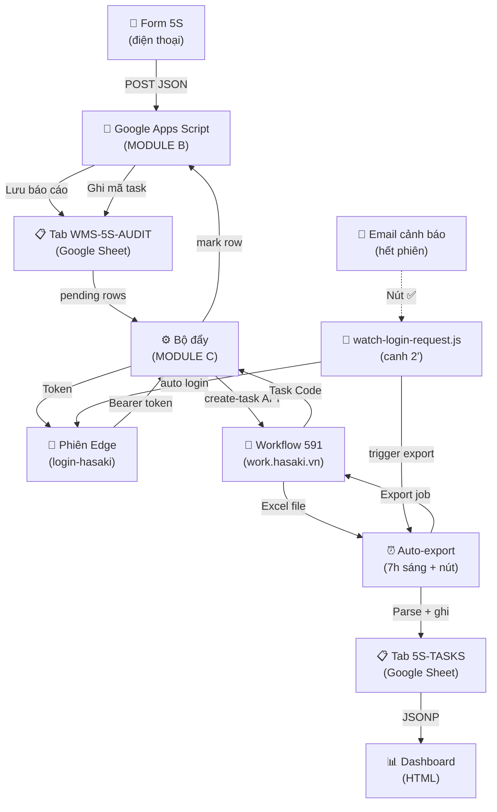

# 📊 PHÂN TÍCH HỆ THỐNG BAOCAO5S — Kiểm soát kho WMS

> **Cập nhật:** 2026-07-07 | **Tác giả:** Phân tích chi tiết | **Mục đích:** Hiểu toàn luồng ghi nhận form → tạo task → quản lý dashboard

---

## 🎯 TỔNG QUAN HỆ THỐNG

Dự án là **hệ thống tự động hóa kiểm soát kho 5S** — từ ghi nhận form trên điện thoại → lưu Google Sheet → tự tạo task xử lý vi phạm → theo dõi dashboard.

```
📱 FORM 5S          Google Sheet        ⚙️ TẠO TASK        🎯 WORKFLOW 591     📊 DASHBOARD
(điện thoại)        + Google Drive      (Node.js)         (work.hasaki.vn)    (HTML)
     │                  │                   │                  │                  │
     └──POST JSON───────┴──Lưu ảnh──────────┴──Gọi API────────┴──Ghi kết quả───┴──Hiển thị
                        
                        ⬅️ ĐỒNG BỘ ←────────────────────────→ (Export Excel → ghi lại Sheet)
                        
                        🔐 ĐĂNG NHẬP (khi hết phiên)
                        • Email + MK → OTP (2FA)
                        • Canh 2 phút 1 lần → tự đăng nhập
```

---

## 📡 KIẾN TRÚC 5 MODULE

### **MODULE A: Thu thập báo cáo (Form 5S)**
**File:** `public/index.html` (deploy `/form-5s` trên GitHub Pages)

| Thành phần | Chi tiết |
|-----------|---------|
| **Giao diện** | Tailwind CSS + Alpine.js (JS framework nhẹ) |
| **Công nghệ nhập ảnh** | `html5-qrcode` (quét mã vạch) + `getUserMedia` (camera live) |
| **4 phần dữ liệu** | (1) Hiện trạng · (2) Vị trí/mã vạch · (3) Hạng mục 5S (31 mục) · (4) Ảnh/clip |
| **Ảnh/clip** | Chụp trực tiếp camera hoặc chọn từ thư viện |
| **Gửi dữ liệu** | `POST` JSON `Content-Type: text/plain` → Apps Script (né CORS preflight) |
| **Quy tắc ghi nhận** | ✅ "Không vi phạm" vẫn lưu nhưng **KHÔNG tạo task** |

**Luồng hành động:**
```
1. Chọn hiện trạng (dropdown) → hiện trạng của vị trí kho
2. Quét/nhập vị trí (mã vạch) → F0-A1-S2 (tầng-dãy-kệ)
3. Tích hạng mục 5S vi phạm (31 mục checkbox)
4. Chụp ảnh/quay clip (camera)
5. Gửi → POST JSON tới Apps Script:
   {
     "ngay": "2026-07-07 14:30",
     "viTri": "F0-A1-S2",
     "hangMuc": ["Sắp xếp", "Vệ sinh"],
     "hienTrang": "Kệ rơi, không phân loại",
     "images": [
       { "mime": "image/jpeg", "base64": "....", "filename": "photo-1.jpg" }
     ]
   }
```

---

### **MODULE B: Lưu trữ & Backend (Google Apps Script + Sheet)**
**File:** `google-script.gs` (source) · `google-script-DEPLOY.gs` (deploy)

#### **Google Sheet — 2 Tab riêng biệt**

| Tab | Vai trò | Cột | Ghi chú |
|-----|---------|-----|--------|
| **WMS-5S-AUDIT** | Inbox báo cáo | 1. Ngày<br>2. Hiện trạng<br>3. Vị trí<br>4. Hạng mục<br>5. Ảnh (URLs)<br>6. **Mã task** (trống = chưa đẩy)<br>7. Thời gian vi phạm | Dữ liệu gốc từ form |
| **5S-TASKS** | Mirror toàn task workflow 591 | Được ghi đè hoàn toàn bởi module E (auto-export) | Cho dashboard hiển thị |

**Google Drive:** Thư mục `WMS-5S-AUDIT-HinhAnh` (chia sẻ ANYONE_WITH_LINK)
- Lưu ảnh gốc từ form
- URL: `https://drive.google.com/uc?id=FILE_ID`

#### **Apps Script Endpoints (doPost + doGet)**

| Action | Kiểu | Tham số | Chức năng | Bảo vệ |
|--------|------|--------|----------|--------|
| `doPost` (không action) | POST | JSON body | Lưu báo cáo + ảnh lên Drive | **key** (Secret) |
| `?action=pending` | GET | Phần trang (25/lần) | Lấy báo cáo chưa đẩy (base64 ảnh) | **key** |
| `?action=mark` | GET | row, code | Ghi mã task vào hàng | **key** |
| `?action=syncTasks` | POST | JSON (task array) | Ghi đè tab 5S-TASKS | **key** |
| `?action=alert` | GET | msg | Gửi email cảnh báo (throttle) | **key** |
| `?action=info` | GET | - | Trả sheetId, URL | Công khai |
| `?action=requestLogin` | GET | - | Đặt cờ "cần đăng nhập" → hiện nút ✅ (email) | Công khai |
| `?action=loginStatus` | GET | - | Hỏi cờ đăng nhập (máy PC) | **key** |
| `?action=clearLogin` | GET | - | Xoá cờ đăng nhập sau 15 phút | **key** |
| `?action=requestSync` | GET | pin, callback | Nút "Cập nhật ngay" trên dashboard | **pin** (SYNC_PIN) |
| `?action=syncStatus` | GET | - | Hỏi cờ cập nhật | **key** |
| `?action=clearSync` | GET | - | Xoá cờ sau khi xong | **key** |

**Bảo mật:**
- ✅ Không commit `google-script-DEPLOY.gs` (có SECRET thật)
- ✅ Lộ Apps Script URL qua form là OK (bảo vệ bằng `key` ở các action nhạy cảm)
- ✅ `key` = `SECRET` trong `.env` → phải giữ bí mật

#### **Redeploy Apps Script (khi sửa backend)**
```
1. Sheet → Tiện ích mở rộng → Apps Script
2. Mở google-script-DEPLOY.gs → copy hết → dán đè
3. Lưu
4. Chạy testGuiMail (lần đầu cấp quyền)
5. Triển khai → Quản lý → ✎ Edit → New version → Triển khai
   (URL /exec giữ nguyên)
```

---

### **MODULE C: Tạo task tự động (Bộ đẩy)**
**File:** `push-5s-to-workflow.js` | Chạy: `DAY-BAO-CAO-5S.bat`

#### **Quy trình:**
```
1️⃣ Lấy TOKEN từ phiên Edge đã đăng nhập
   └─ Mở trình duyệt → navigate tới work.hasaki.vn/tasks-workflow?wfid=591
   └─ Canh header request → lấy Authorization (Bearer token 48 giờ)
   └─ Nếu chưa đăng nhập → báo "Hết phiên, chạy login-hasaki.js"

2️⃣ Lấy báo cáo CHƯA đẩy từ Apps Script
   └─ GET ?action=pending&key=XXX
   └─ Response: { "rows": [...], ...}  (tối đa 25/lần)
   └─ Các hàng có cột 6 (Mã task) = rỗng

3️⃣ Với mỗi báo cáo CÓ vi phạm:
   └─ Khớp hạng mục 5S với "Lỗi vi phạm" (TYPE00) trong workflow
   └─ Dùng Dice similarity (Sørensen–Dice) ≥55% mới chấp
   └─ Nếu khớp tuyệt đối (case-insensitive) → dùng nó
   
4️⃣ Tạo task trên workflow
   └─ Gọi API POST /api/hr/projects/create-task-workflow
   └─ Đính kèm ảnh/video (base64 → FormData → Blob)
   └─ Tên task: "[5S] Vị trí - Hạng mục" (tối đa 90 ký tự)
   └─ Set date_start = ngày vi phạm, date_end = 23:59:00 cùng ngày
   └─ Ghi TYPE00 = lỗi được khớp
   └─ Ghi BIN00 = vị trí gốc
   └─ Note = hiện trạng → mô tả task

5️⃣ Ghi mã task ngược lại Sheet
   └─ GET ?action=mark&row=N&code=TASK_CODE&key=XXX
   └─ Cột 6 tại hàng N được cập nhật
   └─ Lần sau pending sẽ bỏ qua hàng này
```

#### **Khớp lỗi vi phạm (hạng mục → Lỗi):**
```javascript
// Ví dụ: form báo "Sắp xếp" → tìm trong TYPE00
Hạng mục form:      "Sắp xếp"
TYPE00 options:     ["Sắp xếp", "Vệ sinh", "Sắp xếp đúng cách", ...]
├─ Khớp tuyệt đối: "Sắp xếp" ✅ (case-insensitive, chuẩn hoá)
├─ Dice ~0.80 > 0.55 ✅
└─ Chọn tốt nhất

Hạng mục: "thiếu label"
Tìm:      "Thiếu nhãn" (TYPE00)
├─ Dice = 0.67 > 0.55 ✅ (khớp, coi như "label" ≈ "nhãn")
└─ Tạo task với TYPE00 = "Thiếu nhãn"
```

#### **Tệp output log:**
- **Log màn hình:** in console (toàn bộ quá trình)
- **File log:** `day-bao-cao-5s.log` (append)

---

### **MODULE D: Đăng nhập tự động & theo dõi phiên**

#### **D1: login-hasaki.js** — Đăng nhập SSO
**File:** `login-hasaki.js` | Chạy: `node login-hasaki.js` hoặc `LOGIN-HASAKI.bat`

**Cơ chế SSO Hasaki:**
```
work.hasaki.vn/auth/login
    ↓
"Đăng nhập với Hasaki SSO" (nút)
    ↓
auth-idp.hasaki.vn/login/identifier
├─ Ô email (gõ thật)
├─ Turnstile CAPTCHA (bình thường, không cần bypass)
├─ Nút "Tiếp tục" (bấm thật)
    ↓
/login/password
├─ Ô mật khẩu (gõ thật)
├─ Nút tiếp tục
    ↓
/login (OTP)
├─ 6 ô số (hoặc 1 ô nhập 6 số)
├─ OTP tự sinh từ SECRET (TOTP base32)
├─ Chỉ nộp 1 lần, NO retry (chống thoát)
├─ CHỈ nộp khi mã còn ≥10s
    ↓
Callback → work.hasaki.vn
    ↓
Mint JWT → Bearer token (48 giờ) ✅
```

**Chế độ chạy:**
| Mode | Lệnh | Hành động |
|------|------|----------|
| **Thường** | `node login-hasaki.js` | Mở UI, tự điền email+MK, bạn gõ OTP tay |
| **Auto** | `node login-hasaki.js --auto` | Tự làm hết (cần HASAKI_2FA_SECRET) |
| **Dry-OTP** | `node login-hasaki.js --dry-otp` | Tới OTP rồi KHÔNG nộp (test an toàn) |
| **Show** | `node login-hasaki.js --show` | Hiện cửa sổ để debug (mặc định ngầm) |

**Bảo vệ:**
- ✅ Gõ phím THẬT (Puppeteer keyboard) — đáng tin với React
- ✅ OTP 1 lần, không retry → chống vô hiệu hoá tài khoản
- ✅ File lock (`.login-open.lock`) chống chạy chồng <15 phút
- ✅ Headless off, nhưng cửa sổ ở (-32000, -32000) = ngoài màn hình
- ✅ Phiên lưu trong profile Edge (~/.wms-session/edge-profile) — ổn định

**Khoá chống:**
```javascript
// Trong edge-profile/Default/Preferences
{
  "profile": {
    "exit_type": "Normal",
    "exited_cleanly": true    // ← Bảo vệ lỗi "Restore session?"
  }
}
```

#### **D2: watch-login-request.js** — Canh theo dõi phiên
**File:** `watch-login-request.js` | Chạy mỗi ~2 phút (Task Scheduler)

**Quy trình canh:**
```
Chạy 1 lần → hỏi Apps Script 2 cờ hiệu lực 15 phút:

1️⃣ Cờ CẬP NHẬT DASHBOARD (nút "Cập nhật ngay" + PIN)
   ├─ Gọi ?action=syncStatus → nếu .requested = true
   ├─ Xoá cờ → ?action=clearSync
   ├─ Chạy auto-export-sync.js (chờ xong)
   └─ Exit

2️⃣ Cờ ĐĂNG NHẬP (nút trong email từ điện thoại/web)
   ├─ Nếu .login-open.lock tồn tại <15' → bỏ qua (đang login)
   ├─ Gọi ?action=loginStatus → nếu .requested = true
   ├─ Xoá cờ → ?action=clearLogin
   ├─ Chạy login-hasaki.js (nền, không chờ)
   └─ Exit

💡 Lợi ích: Email → Nút ✅ → Cắt cờ → Auto login ngay
           Dashboard → Nút Cập nhật → Cắt cờ → Auto export
```

---

### **MODULE E: Đồng bộ & Dashboard**

#### **E1: auto-export-sync.js** — Xuất & đồng bộ tự động
**File:** `auto-export-sync.js` | Chạy: `DONG-BO-TASK.bat`

**Quy trình:**
```
1️⃣ Lấy TOKEN từ Edge (như Module C)

2️⃣ Chia ngày thành cửa sổ ≤60 ngày (an toàn < 3 tháng export)
   └─ SYNC_FROM = 2026-04-01 (mốc khởi động workflow)
   └─ Tới hôm nay
   └─ VD: [2026-04-01..2026-05-30], [2026-05-31..2026-07-07]

3️⃣ Với mỗi cửa sổ:
   ├─ POST /api/hr/excel-io/export (queue job)
   │  └─ param[from_date], param[to_date], type=6 (board), wfid=591
   ├─ Poll GET /api/hr/excel-io mỗi 3s
   ├─ Chờ status=1 + file_path
   ├─ TẢI file từ wshr.hasaki.vn/production/hr/FILE_PATH (công khai)
   ├─ LƯU vào .exports/
   └─ Hết timeout 60 lần (180s) → báo lỗi

4️⃣ Đọc file Excel:
   ├─ Parse như sync-board-to-sheet.js
   ├─ Gộp toàn bộ cửa sổ
   ├─ Chuẩn hoá cột (task code, link, status, TYPE00, ...)
   ├─ Chuyển media URL (task_wfconfig/ → hr-media.hasaki.vn)

5️⃣ POST syncTasks → Apps Script
   ├─ Ghi đè hoàn toàn tab 5S-TASKS
   └─ Dashboard sẽ đọc lại từ đó

🔐 Chống chạy chồng:
   └─ File lock (.export-running.lock)
   └─ Nếu có <10' → bỏ qua (nền + nút Cập nhật có xung đột)
```

#### **E2: dashboard-5s.html** — Dashboard theo dõi
**File:** `dashboard-5s.html` | Deploy: GitHub Pages / Self-host

**Giao diện:**
```
┌────────────────────────────────────────────────────────────┐
│ 📊 Dashboard 5S — Kiểm soát kho      [↻ Tải lại] [⟳ Cập nhật]│
│ Nguồn: Sheet 5S-TASKS | Cập nhật 2026-07-07 14:30:00       │
│ ┌─────────────────────────────────────────────────────────┐│
│ │ [Vi phạm]  [Xác nhận]  [Hoàn thành]  [Từ chối]  [Quá hạn]││
│ │   42         15           8            2         1      ││
│ └─────────────────────────────────────────────────────────┘│
│                                                            │
│ Từ ngày [____] Đến ngày [____] Trạng thái [▼]           │
│ Lỗi vi phạm [▼]  Tìm (vị trí/mã) [____________]          │
│                                                            │
│ ┌──────────────────────────────────────────────────────────┐│
│ │ Task vi phạm (42)                                        ││
│ ├──────┬──────────┬──────────────┬─────────────┬──────────┤│
│ │ Ảnh  │   Mã    │ Ngày vi phạm │ Lỗi vi phạm │ Vị trí   ││
│ ├──────┼──────────┼──────────────┼─────────────┼──────────┤│
│ │ 🖼️  │ HSK-001  │ 2026-07-05   │ Sắp xếp     │ F0-A1-S2 ││
│ │      │ [xem]   │              │             │          ││
│ ├──────┼──────────┼──────────────┼─────────────┼──────────┤│
│ │ 🎬   │ HSK-002  │ 2026-07-04   │ Vệ sinh     │ F1-B3    ││
│ │      │ [xem]   │              │             │          ││
│ └──────┴──────────┴──────────────┴─────────────┴──────────┘│
└────────────────────────────────────────────────────────────┘

[Bấm ảnh] → Lightbox toàn màn hình
[Bấm Mã]  → Modal chi tiết (ảnh, clip, thông tin task)
Bộ lọc    → Lọc theo ngày, status, lỗi, vị trí/mã
```

**Công nghệ:**
- **Tailwind CSS** (CSS utility framework)
- **JavaScript Vanilla** (không framework)
- **Google Sheets API** (lấy dữ liệu từ Sheet qua CORS)
- **Lightbox** (ảnh/clip popup)
- **Modal chi tiết** (toàn thông tin task)

**Cột hiển thị:**
| Header | Từ Sheet | Dịch tiếng Việt |
|--------|---------|-----------------|
| task code | A | Mã công việc |
| link task | B | Liên kết công việc |
| task name | C | Tên công việc |
| status | D | Trạng thái |
| created by | E | Người tạo |
| created at | F | Thời gian tạo |
| deadline | G | Hạn chót |
| TYPE00 (Lỗi) | H | Lỗi vi phạm |
| BIN00 (Vị trí) | I | Vị trí ghi nhận |
| IMA00 (Ảnh) | J | Ảnh (URLs) |
| VID01 (Clip) | K | Clip (URLs) |
| DATE00 (Ngày VP) | L | Ngày vi phạm |
| ... | ... | ... |

**Chức năng:**
```javascript
✅ Tải dữ liệu từ Sheet (JSONP để né CORS)
✅ Lọc theo ngày, status, lỗi, vị trí
✅ Hiển thị thống kê (card tóm tắt)
✅ Lightbox ảnh/clip (click → toàn màn hình)
✅ Modal chi tiết task (toàn thông tin)
✅ Nút "Tải lại" (refresh dữ liệu)
✅ Nút "Cập nhật ngay" (trigger auto-export, cần PIN)
```

**Bấm "Cập nhật ngay":**
```
1. Nhập PIN (SYNC_PIN từ .env)
2. POST ?action=requestSync&pin=XXXX&callback=...
3. Apps Script cắt cờ SYNC_REQUESTED = true
4. watch-login-request.js canh 2' → thấy cờ
5. Chạy auto-export-sync.js
6. Dashboard định kỳ poll → thấy dữ liệu mới
```

---

## 🔄 LUỒNG DỮ LIỆU TOÀN HỆ THỐNG

### **Luồng A: Ghi nhận form → Tạo task**
```
┌─────────────────────────────────────────────────────────────────────────┐
│ TIME: T₀ (ghi nhận form trên điện thoại) ──────> T₁ (chạy bộ đẩy)      │
└─────────────────────────────────────────────────────────────────────────┘

T₀ (14:30:00):
  👨 Nhân viên kho dùng form 5S
  ├─ Quét vị trí: F0-A1-S2
  ├─ Chọn hạng mục: ["Sắp xếp", "Vệ sinh"]
  ├─ Ghi hiện trạng: "Kệ rơi không sắp xếp"
  ├─ Chụp ảnh: 2 ảnh
  └─ Gửi → POST JSON tới APPSCRIPT_URL

T₀+10s (14:30:10):
  🤖 Google Apps Script nhận
  ├─ Lưu 1 hàng vào tab WMS-5S-AUDIT
  │  ├─ A: 2026-07-05 14:30
  │  ├─ B: Kệ rơi không sắp xếp
  │  ├─ C: F0-A1-S2
  │  ├─ D: Sắp xếp, Vệ sinh
  │  ├─ E: https://drive.google.com/uc?id=...
  │  ├─ F: (trống = chưa đẩy)
  │  └─ G: 2026-07-05 14:30:00
  └─ Lưu ảnh lên Google Drive

T₀+15 min (14:45):
  ⏰ Lịch chạy bộ đẩy DAY-BAO-CAO-5S.bat
  │ (hoặc chạy tay: node push-5s-to-workflow.js)
  │
  ├─ Lấy token từ Edge
  ├─ Gọi ?action=pending → lấy 25 báo cáo chưa đẩy
  │  └─ Nhận báo cáo ở T₀
  ├─ Khớp "Sắp xếp" → TYPE00 = "Sắp xếp" ✅
  ├─ Khớp "Vệ sinh" → TYPE00 = "Vệ sinh" ✅
  │  (nếu một hạng mục không khớp → báo lỗi, bỏ qua hàng này)
  ├─ Tạo task trên workflow 591:
  │  └─ Gọi POST /api/hr/projects/create-task-workflow
  │  ├─ name: "[5S] F0-A1-S2 - Sắp xếp"
  │  ├─ date_start/date_end: 2026-07-05
  │  ├─ TYPE00: "Sắp xếp"
  │  ├─ BIN00: "F0-A1-S2"
  │  ├─ note: "Kệ rơi không sắp xếp"
  │  ├─ ảnh (2): base64 → Blob → FormData
  │  └─ Nhận Task Code: HSK-00042
  ├─ Ghi mã task ngược lại:
  │  └─ GET ?action=mark&row=2&code=HSK-00042
  │  └─ Hàng 2 cột F = "HSK-00042"
  └─ Log: "✅ Hàng 2: HSK-00042 (2 ảnh, TYPE00=Sắp xếp)"

⚠️ Lưu ý: Nếu hết phiên work.hasaki.vn
  ├─ getToken() báo lỗi
  ├─ Gửi email cảnh báo (throttle, max 1/session)
  ├─ Đặt cờ requestLogin (Apps Script)
  └─ watch-login-request.js sẽ auto login lần tiếp theo
```

### **Luồng B: Tự động đăng nhập khi hết phiên**
```
┌─────────────────────────────────────────────────────────────────────────┐
│ Khi token hết hiệu lực (48h) hoặc logout                               │
│ Có 2 cách trigger đăng nhập lại:                                       │
│   (1) Email bấm nút ✅ từ điện thoại/web → Cắt cờ requestLogin         │
│   (2) Bộ đẩy detect hết phiên → Gửi email + Cắt cờ                   │
└─────────────────────────────────────────────────────────────────────────┘

Cách (1): Email → Nút từ điện thoại
  👨 Bấm nút ✅ từ điện thoại → Gọi ?action=requestLogin
                              → Apps Script cắt cờ
  
  Cách (2): Phát hiện hết phiên → Email + Cắt cờ
  ⚙️ Bộ đẩy (Module C) chạy
     ├─ getToken() → /login, không lấy được token
     ├─ Báo lỗi: "Phiên đã hết hạn"
     ├─ sendAlert() → Email tới th76tamle02@gmail.com
     │  └─ "⚠️ Phiên work.hasaki.vn hết → Hãy bấm nút ✅"
     └─ Apps Script cắt cờ requestLogin

  💡 Email có nút ✅ → Nút gọi:
     GET ?action=requestLogin
        → Apps Script cắt cờ requestLogin = true

⏰ watch-login-request.js canh mỗi 2 phút
  ├─ Hỏi ?action=loginStatus&key=XXX
  ├─ Nếu { "requested": true } → Có cờ
  ├─ Xoá cờ: ?action=clearLogin
  ├─ Chạy: node login-hasaki.js --auto (nền)
  │  └─ Tự điền email, mật khẩu, OTP (TOTP)
  │  └─ Mint token 48h mới
  └─ Quay lại lịch chạy bộ đẩy lần sau

⚠️ Chống vô hiệu hoá tài khoản:
  ✅ OTP chỉ gõ 1 lần (không retry nếu sai)
  ✅ Chỉ gõ nếu mã còn ≥10s hiệu lực
  ✅ File lock chống chạy chồng <15 phút
```

### **Luồng C: Đồng bộ dashboard (Export Excel → Sheet → Dashboard)**
```
┌─────────────────────────────────────────────────────────────────────────┐
│ Từ workflow → Export Excel → Ghi tab 5S-TASKS → Dashboard thấy         │
│ (TỰ ĐỘNG 7h sáng hoặc BẤM NÚT "Cập nhật ngay" + PIN)                  │
└─────────────────────────────────────────────────────────────────────────┘

Cách (1): Tự động 7h sáng (lịch Task Scheduler)
  ⏰ 07:00:00 (Windows Task Scheduler)
  └─ auto-export-sync.js

Cách (2): Dashboard bấm nút "Cập nhật ngay" + PIN
  👨 Bấm nút → Nhập PIN (SYNC_PIN = "1234" hoặc gì đó)
            → Dashboard gọi ?action=requestSync&pin=XXXX&callback=
            → Apps Script xác thực PIN
            └─ Nếu đúng: cắt cờ SYNC_REQUESTED = true
            └─ Nếu sai:  báo lỗi

  ⏰ watch-login-request.js canh 2'
  ├─ Hỏi ?action=syncStatus&key=XXX
  ├─ Nếu { "requested": true } → Có yêu cầu cập nhật
  ├─ Xoá cờ: ?action=clearSync
  ├─ Chạy: node auto-export-sync.js (chờ xong)
  └─ auto-export-sync.js:

auto-export-sync.js (tự động 100%):
  
  1️⃣ Lấy token từ Edge (như Module C)
  2️⃣ Chia ngày thành cửa sổ ≤60 ngày
     └─ Từ 2026-04-01 tới hôm nay (2026-07-07)
     └─ VD: [2026-04-01..2026-05-30], [2026-05-31..2026-07-07]
  3️⃣ Với mỗi cửa sổ:
     ├─ Queue job export (POST /api/hr/excel-io/export)
     ├─ Poll status (GET /api/hr/excel-io)
     ├─ Tải file Excel (https://wshr.hasaki.vn/production/hr/...)
     ├─ Parse (XLSX library)
     └─ Gộp toàn bộ window
  4️⃣ Chuẩn hoá dữ liệu:
     ├─ Dịch cột: "task code" → "Mã công việc"
     ├─ Chuyển media: task_wfconfig/ → hr-media.hasaki.vn
     └─ Định dạng date
  5️⃣ Ghi tab 5S-TASKS:
     └─ POST ?action=syncTasks&key=XXX body=JSON array

📊 Dashboard thấy dữ liệu mới:
  ├─ JSONP GET từ Sheet (Collaborative API)
  ├─ Cập nhật bộ lọc, thống kê
  ├─ Render bảng (42 task, 15 xác nhận, ...)
  └─ Người xem thấy tức thì
```

---

## 🛡️ BẢO MẬT & CẤU HÌNH

### **Biến .env (KHÔNG commit)**
```env
# Bí mật Apps Script
APPSCRIPT_URL=https://script.google.com/macros/s/AKfycbz...
APPSCRIPT_KEY=SECRET123XYZ          # ← Trùng SECRET trong google-script.gs

# Tài khoản đăng nhập work.hasaki.vn
HASAKI_EMAIL=user@example.com
HASAKI_PASSWORD=mật_khẩu_thật
HASAKI_2FA_SECRET=JBSWY3DP...       # ← Base32 (TOTP)

# Workflow & staff
WORKFLOW_ID=591
STAFF_ID=17312                       # ← Mặc định giao cho ai (Lê Chí Tâm)

# Đường dẫn Edge
EDGE_PROFILE_DIR=C:/path/to/.wms-session/edge-profile

# Mốc đồng bộ
SYNC_FROM=2026-04-01

# PIN bảo vệ nút "Cập nhật ngay"
SYNC_PIN=1234
```

### **Gitignore (bảo vệ bí mật)**
```
.env                        # ← Biến môi trường
.env.example                # ← Mẫu (.env.example CÓ commit)
.wms-session/               # ← Profile Edge (phiên login)
.exports/                   # ← File Excel export temp
.login-open.lock            # ← File lock đăng nhập
.export-running.lock        # ← File lock auto-export
day-bao-cao-5s.log         # ← Log chạy
dong-bo-task.log           # ← Log đồng bộ
watch-login.log            # ← Log canh
auto-export.log            # ← Log auto-export
google-script-DEPLOY.gs    # ← Deploy lên Apps Script (có SECRET thật)
node_modules/              # ← Dependencies
```

### **Quyền cấp trong Apps Script**
```
Lần đầu chạy google-script-DEPLOY.gs:

Quyền cần:
  ✅ Google Sheets (đọc/ghi tab)
  ✅ Google Drive (lưu ảnh)
  ✅ Gmail (gửi email cảnh báo)
  ✅ Google Apps Script (các hàm)

Người dùng tài khoản Sheet → Approve quyền → Xong
```

---

## 📋 CÁC LỆNH CHẠY THƯỜNG DÙNG

| Tác vụ | Lệnh | Chế độ |
|--------|------|-------|
| **Ghi nhận form 5S** | Mở form qua link | Real-time, điện thoại |
| **Tạo task** | `DAY-BAO-CAO-5S.bat` | Lịch 14:45 (hoặc tay) |
| **Đăng nhập auto** | `node login-hasaki.js --auto` | Tự động nếu có SECRET |
| **Đăng nhập tay OTP** | `node login-hasaki.js` | Bạn gõ OTP (nếu thiếu SECRET) |
| **Canh phiên & cập nhật** | Task Scheduler 2' → `watch-login-request.js` | Background |
| **Đồng bộ dashboard** | `DONG-BO-TASK.bat` (7h sáng hoặc nút) | Lịch + on-demand |
| **Xem dashboard** | Mở dashboard-5s.html | Real-time web |

---

## ⚡ TRƯỜNG HỢP VẬN HÀNH

### **Trường hợp 1: Hệ thống bình thường**
```
1️⃣ 14:30 — Nhân viên ghi form trên điện thoại
2️⃣ 14:45 — Bộ đẩy tự chạy
   ├─ Lấy token từ phiên Edge
   ├─ Tạo task trên workflow
   └─ Ghi mã task vào Sheet
3️⃣ 07:00 (sáng hôm sau) — Auto-export chạy
   ├─ Export Excel từ workflow
   ├─ Ghi tab 5S-TASKS
   └─ Dashboard thấy dữ liệu mới
4️⃣ Quản lý xem dashboard → lọc → xử lý
```

### **Trường hợp 2: Token hết 48h**
```
1️⃣ 14:45 — Bộ đẩy chạy
   ├─ getToken() → page redirect /login → báo lỗi
   ├─ sendAlert("Phiên hết, vui lòng đăng nhập lại")
   ├─ Email tới quản lý
   └─ Cắt cờ requestLogin
2️⃣ Quản lý bấm nút ✅ trong email (lúc 15:00)
   └─ Cắt cờ requestLogin = true
3️⃣ watch-login-request.js canh (15:02)
   ├─ Thấy cờ
   ├─ Chạy login-hasaki.js --auto
   └─ Mint token 48h mới
4️⃣ Bộ đẩy lần sau chạy (16:45)
   ├─ getToken() ✅
   ├─ Tạo task tiếp tục
   └─ Bình thường
```

### **Trường hợp 3: Nút "Cập nhật ngay" trên dashboard**
```
1️⃣ Quản lý bấm nút "Cập nhật ngay" (14:30)
   ├─ Nhập PIN: 1234
   ├─ Dashboard gọi ?action=requestSync&pin=1234
   └─ Apps Script xác thực + cắt cờ
2️⃣ watch-login-request.js canh (14:32)
   ├─ Thấy cờ SYNC_REQUESTED
   ├─ Chạy auto-export-sync.js (chờ xong)
   └─ Ghi tab 5S-TASKS
3️⃣ Dashboard định kỳ refresh
   ├─ Lấy dữ liệu mới từ Sheet
   └─ Cập nhật bảng tức thì
```

---

## 🎯 TÓᲛ TẮT FLOW CHÍNH



---

## ✅ CHECKLIST VẬN HÀNH

- [ ] ✅ `.env` có đầy đủ SECRET, email, password, 2FA_SECRET, PIN
- [ ] ✅ `google-script-DEPLOY.gs` deployed lên Apps Script (URL /exec cố định)
- [ ] ✅ Profile Edge (~/.wms-session/) tồn tại + đã đăng nhập lần đầu
- [ ] ✅ Windows Task Scheduler chạy `DAY-BAO-CAO-5S.bat` (14:45) + `watch-login-request.js` (2')
- [ ] ✅ Google Sheet được chia sẻ (service account nếu dùng)
- [ ] ✅ Form 5S deploy trên GitHub Pages hoặc tự host
- [ ] ✅ Dashboard deploy trên GitHub Pages hoặc tự host
- [ ] ✅ Test 1 lần đầy đủ: form → task → dashboard

---

## 📞 SUPPORT

| Vấn đề | Giải pháp |
|--------|----------|
| Phiên hết, không auto login | Bấm nút ✅ trong email HOẶC chạy `LOGIN-HASAKI.bat` tay |
| Bộ đẩy báo lỗi API | Kiểm tra token (hết phiên?) + WORKFLOW_ID đúng |
| Dashboard không cập nhật | Chạy `DONG-BO-TASK.bat` hoặc bấm nút "Cập nhật ngay" + PIN |
| File lock dính | Xoá file `.login-open.lock`, `.export-running.lock` |
| TOTP fail (OTP) | Kiểm tra HASAKI_2FA_SECRET (base32 chuẩn?) + đồng hồ chính xác |
| Email cảnh báo không tới | Kiểm tra ALERT_EMAIL, Gmail allow less secure |

---

**Viết bởi:** Lê Chí Tâm  
**Ngày cập nhật:** 2026-07-07  
**Phiên bản:** 1.0.0
